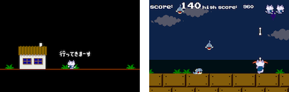

## 「ピラニアン」とは

このゲーム「ピラニアン」は「[第２回 京都インディーズゲームセミナー Unity入門講座](http://atnd.org/events/38509)」のライブコーディングセッションにおいて作成されたゲームです。約 1 時間のセッションの中で 2D ゲームのプロトタイプを作成しました。

すべての絵素材および音素材は[開発室 Pixel](http://hp.vector.co.jp/authors/VA022293/) の天谷大輔氏によって作成されました。プログラミングおよび Unity 上の作業は[ユニティー・テクノロジーズ・ジャパン](http://japan.unity3d.com/)が担当しました。

現在、このゲームをきちんと遊べるものとして完成させるべく、開発作業を続けています。最終的には iTunes App Store のようなストア上で配布することも予定しています。お楽しみに！

ライブコーディングで作成した「プロトタイプバージョン」、完成を目指して開発している「最新バージョン」は、それぞれ下記のページからプレイできます。

## 「ピラニアン」をプレイする

### 最新バージョン

ここでは、完成を目指して開発しているゲームの最新バージョンをプレイできます。開発途中なので、たまに不安定になったり、ゲームバランスが崩れていたりすることがあるかもしれませんが、そこは目をつぶってくださいね！

- 最新バージョンをプレイする（近日公開予定）

### プロトタイプバージョン

ここでは、１時間のライブコーディングで作成したプロトタイプバージョンをプレイすることができます。細かな作り込みを行うまでには至っていませんが、いちおうゲームとして遊べるものができています。

- [プロトタイプバージョンをプレイする](/piranhan/versions/prototype/)

## 「ピラニアン」を参考にする

「ピラニアン」は[ゲームエンジン Unity](http://japan.unity3d.com/) を使用して作られています。このソースプロジェクトは下記のページにおいて公開されています。

- [GitHub - unity3d-jp/piranhan](https://github.com/unity3d-jp/piranhan)

Unity を使用した 2D ゲーム開発の参考にしてください。

## 問い合わせ

「ピラニアン」についてのお問い合わせは以下の窓口までお願いします。

- [Unity Japan 公式 Twitter アカウント](https://twitter.com/unity_japan)
- [お問い合わせフォーム](http://japan.unity3d.com/company/contact/)

バグ報告や要望は [GitHub の issues](https://github.com/unity3d-jp/piranhan/issues) からいただけると助かります（使い方が分からない場合は上の窓口からでもいいですよ！）。
